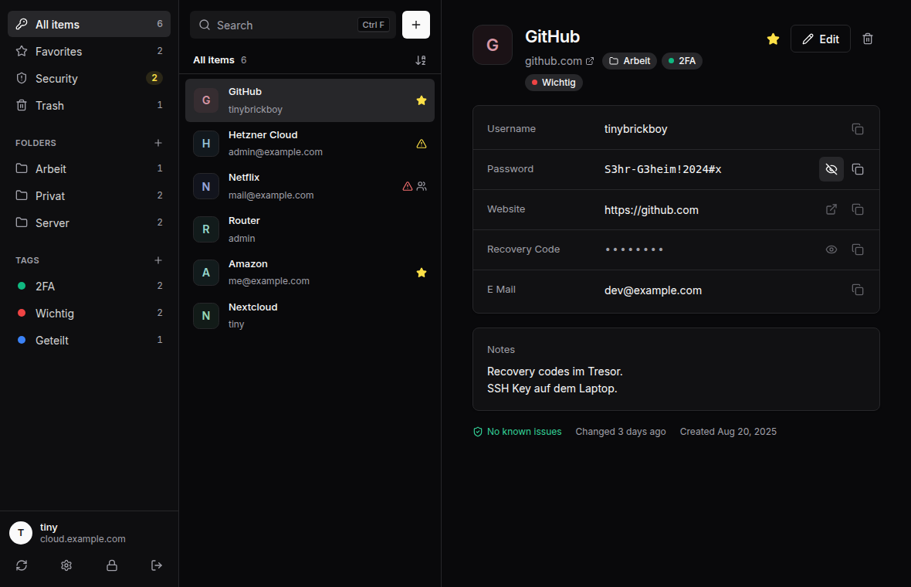
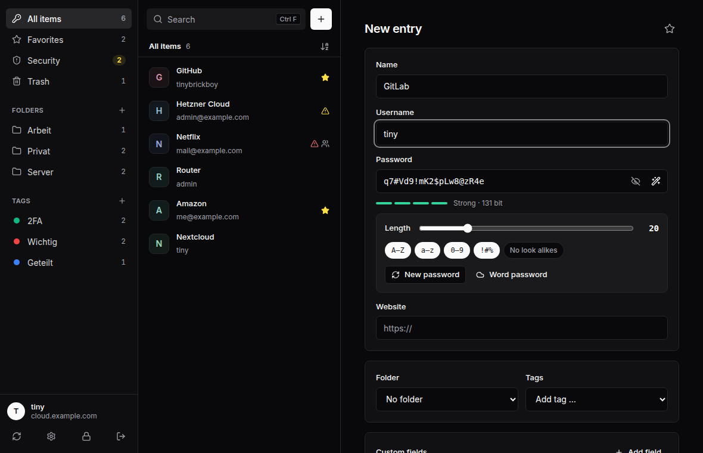
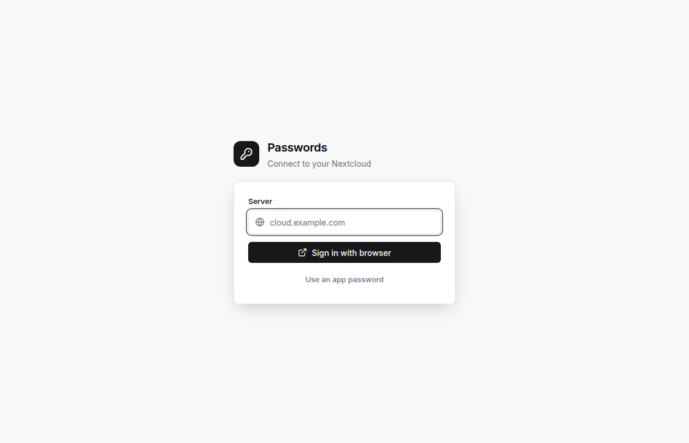

# Passwords Desktop

A clean, minimal desktop client for the [Nextcloud Passwords](https://apps.nextcloud.com/apps/passwords) app.
Runs on Linux and Windows.



## Features

- **Sign in** with the Nextcloud login flow (confirm in your browser) or with an app password
- **End to end encryption** (CSEv1) with your encryption password, plus second factor codes when unlocking
- **Organize** with folders, tags and favorites, search across names, usernames, websites, notes and custom fields
- **Edit** entries with custom fields (text, secret, email, link), tags and folders
- **Password generator** with length and character options, or word passwords from your Nextcloud
- **Security overview** of breached, duplicate and outdated passwords reported by the server
- **Trash** with restore, delete forever and empty trash
- **Website icons** loaded through your Nextcloud, kept in memory only
- **Clipboard** is cleared automatically after copying (configurable)
- **Auto lock** after inactivity, shown only when unlocking actually asks for something (encryption password or second factor)
- **Light and dark theme**, following the system or chosen manually
- **Languages:** English and German, following the system language or chosen manually

| Editor | Sign in |
|---|---|
|  |  |

### Keyboard shortcuts

| Shortcut | Action |
|---|---|
| Ctrl+F | Search |
| Ctrl+N | New entry |
| Ctrl+E | Edit selected entry |
| Ctrl+C | Copy password of selected entry |
| Ctrl+B | Copy username |
| Ctrl+S | Save (in the editor) |
| Ctrl+L | Lock |
| Ctrl+, | Settings |
| ↑ ↓ | Select entry |
| Enter (in search) | Copy password |
| Delete | Move to trash |
| Esc | Clear search, close editor |

## Download

Installers for Linux (`.deb`, `.rpm`, `.AppImage`) and Windows (`.msi`, `.exe`) are attached to every
[release](https://github.com/TinyBrickBoy/nextcloud-passworts-desktop/releases).

## Tech stack

| Part | Choice | Why |
|---|---|---|
| App shell | [Tauri 2](https://tauri.app) | Small binaries, uses the system webview, native installers for Linux and Windows |
| Backend | Rust | Networking, cryptography and clipboard run outside the webview |
| Cryptography | `argon2`, `blake2`, `crypto_secretbox` | Pure Rust equivalents of the libsodium functions, tested against real libsodium vectors |
| Credentials | `keyring` | The app password lives in the system keyring (Secret Service / Windows Credential Manager) |
| UI | Svelte 5 + TypeScript + Vite | Little code, no heavy UI framework |
| Design | shadcn style HSL tokens, Inter, Lucide icons | Clean and calm, no gradients |

## Security

- The app password is never written to a file, only to the system keyring.
- The encryption password is only kept in memory while unlocking.
- Passwords only reach the UI when you click “Show”. Copying goes straight from the backend to the clipboard.
- Locking closes the session on the server and drops the decrypted vault.
- Website icons are cached in memory only, so no list of your websites ends up on disk.
- Strict Content Security Policy, the webview cannot open outside connections.

## Development

Requirements: Node.js 22, Rust (stable) and the [Tauri prerequisites](https://tauri.app/start/prerequisites/).
On Debian/Ubuntu:

```sh
sudo apt install libwebkit2gtk-4.1-dev libgtk-3-dev libayatana-appindicator3-dev librsvg2-dev libxdo-dev
```

```sh
npm install
npm run tauri dev      # start the app with hot reload
npm run tauri build    # build installers (.deb, .rpm, .AppImage or .msi, .exe)
npm run check          # type check the UI
cd src-tauri && cargo test --release   # Rust tests
```

The `Build` workflow tests every pull request and builds the installers as artifacts.

### Adding a language

1. Copy `src/lib/locales/en.ts` to `src/lib/locales/<code>.ts` and translate the values.
2. Register it in `src/lib/i18n.svelte.ts` (`dictionaries` and `languages`).
3. Add the backend messages to `src-tauri/src/i18n.rs`.

## Creating a release

1. On GitHub go to **Releases → Draft a new release** and create a new tag, e.g. `v0.2.0`
   (`v1.2.3`; short tags like `v1.0` or `2` are completed to `1.0.0` or `2.0.0`).
2. Click **Publish release**.
3. The `Release` workflow takes the version from the tag, builds for Linux and Windows and attaches
   `.deb`, `.rpm`, `.AppImage`, `.msi` and `.exe` to the release. This takes about 10 to 15 minutes.

## Project layout

```
src/                         UI (Svelte)
  App.svelte                 Flow: set up → unlock → vault
  lib/Setup.svelte           Connect a server
  lib/Unlock.svelte          Encryption password and second factor
  lib/Vault.svelte           Main view, filters, keyboard shortcuts
  lib/vault/                 Sidebar, list, details, editor, generator, settings
  lib/components/            Avatar, dialogs, toast, strength meter
  lib/locales/               Translations
  lib/api.ts                 Calls into the Rust backend
src-tauri/src/
  api.rs                     HTTP client for the Passwords API
  account.rs                 Login flow v2, account and keyring
  crypto.rs                  PWDv1 challenge, CSEv1 keychain and field encryption
  vault.rs                   Decrypted vault, saving, trash, folders, tags
  generator.rs               Local password generator
  settings.rs                App settings
  i18n.rs                    Backend messages
  clipboard.rs               Clipboard with automatic clearing
  lib.rs                     Tauri commands
```

## Notes on the Passwords API

Documentation: [Developer Handbook](https://git.mdns.eu/nextcloud/passwords/-/wikis/Developers/Index)

- Base: `https://<server>/index.php/apps/passwords/api/1.0/`, basic auth with user and app password, HTTPS only.
- Session: `GET session/request` returns what is needed to open a session (`challenge`, `token`).
  `POST session/open` opens it and returns the encrypted keychains when encryption is used.
  Without encryption the server returns `"keys": []` (an empty PHP array) instead of an object.
  The `X-API-SESSION` header must be sent with every request, always the latest value received.
  `GET session/keepalive` keeps it open. After five wrong attempts the server blocks the client.
- PWDv1 challenge: `generichash(64, password + salt0, key = salt1)` → `pwhash(32, hash, salt2, INTERACTIVE, Argon2id13)` → hex.
- CSEv1 keychain: hex(`salt(16) + nonce(24) + secretbox(json)`), key = `pwhash(32, password, salt)`.
  Content `{ keys: { uuid: hexKey }, current: uuid }`.
- CSEv1 fields: hex(`nonce + secretbox(value)`) with the key from `cseKey`.
  Encrypted are `label, username, password, url, notes, customFields` for passwords, `label` for folders and `label, color` for tags.
- Passwords: `password/list|show|find|create|update|delete|restore`. Send the known `revision` on update so the server
  rejects stale data. With CSE the client has to compute the SHA1 `hash` itself.
  Trashed passwords come from `password/find` with the criteria `{ "trashed": true }`.
- Tags on a password: an empty `tags` array changes nothing and an unknown id is rejected (“Tag does not exist”).
  To remove all tags send `[""]`.
- Folders: `folder/list|create|update|delete`, the base folder is `00000000-0000-0000-0000-000000000000`.
- Favicons: `service/favicon/{domain}/{size}`, rate limited to 15 requests per 15 seconds.

## License

MIT
